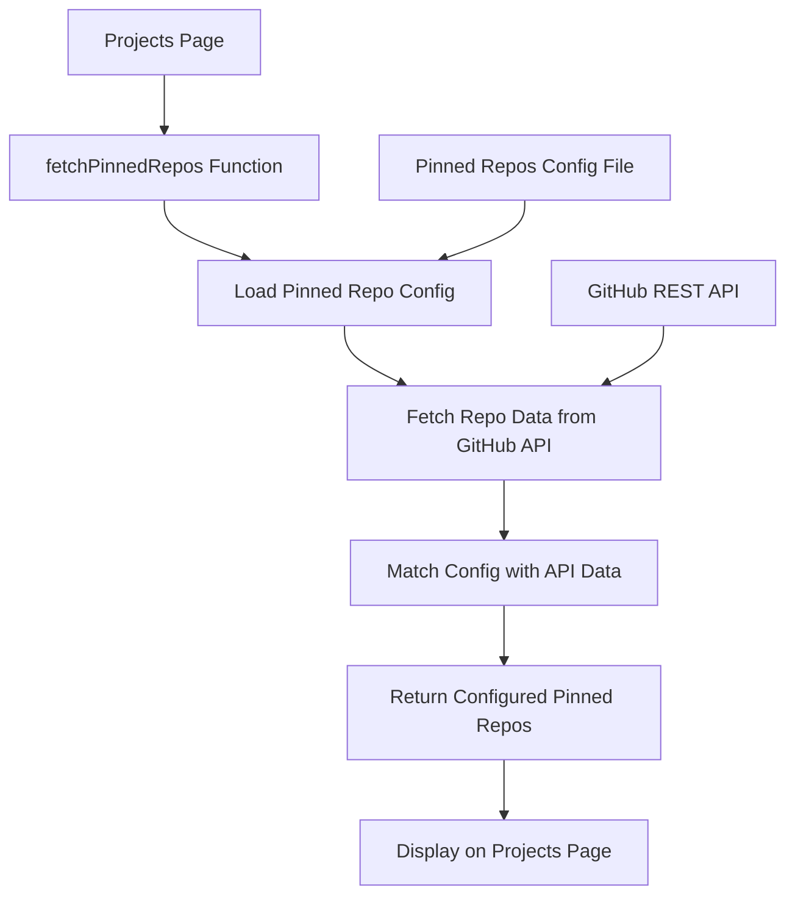

# Pinned Repositories Implementation Plan

## Overview
Implement manual configuration for pinned repositories to replace the current heuristic-based approach while maintaining GitHub API integration.

## Current State Analysis
- Uses GitHub REST API to fetch all repositories
- Applies heuristic algorithm to determine "important" repos based on stars and activity
- Displays top 6 repositories automatically
- No way to specify which repos should actually be pinned

## Architecture



## Implementation Phases

### Phase 1: Create Configuration System
1. **Create pinned repositories configuration file** (`lib/pinned-repos-config.ts`)
   - Define interface for pinned repo configuration
   - List specific repository names to pin
   - Include optional display order and custom descriptions
   - Allow for repository aliases/display names

### Phase 2: Enhance GitHub Integration
2. **Update GitHub API integration** (`lib/github.ts`)
   - Modify `fetchPinnedRepos()` to use configuration instead of heuristics
   - Create new function to fetch specific repositories by name
   - Add error handling for repositories that don't exist
   - Maintain fallback behavior if configured repos aren't found

### Phase 3: Data Matching and Processing
3. **Implement configuration-to-API data matching**
   - Match configured repository names with GitHub API responses
   - Preserve custom display names and descriptions from config
   - Handle cases where configured repos don't exist or are private
   - Maintain original GitHub data (stars, forks, language, etc.)

### Phase 4: Enhanced Features
4. **Add advanced configuration options**
   - Custom descriptions that override GitHub descriptions
   - Display order specification
   - Ability to hide certain metadata (stars, forks, etc.)
   - Featured/highlighted repository designation

## Technical Implementation Details

### Configuration Structure
```typescript
interface PinnedRepoConfig {
  repoName: string;           // GitHub repository name
  displayName?: string;       // Custom display name (optional)
  customDescription?: string; // Override GitHub description (optional)
  order?: number;            // Display order (optional)
  featured?: boolean;        // Highlight this repo (optional)
}
```

### API Integration Strategy
- Keep using GitHub REST API for public access
- Fetch repositories individually or in batch based on configuration
- Implement caching strategy for better performance
- Add graceful degradation for missing repositories

### Error Handling & Fallbacks
- Handle repositories that don't exist
- Manage private repositories (won't be accessible via public API)
- Provide fallback to original heuristic if configuration is empty
- Display helpful error messages for debugging

## Benefits

1. **Full Control**: Decide exactly which repositories to showcase
2. **Flexibility**: Easy to update without code changes (just config updates)
3. **Performance**: Only fetch data for repositories you actually want to display
4. **Customization**: Override descriptions, names, and order as needed
5. **Maintainability**: Clear separation between configuration and implementation
6. **No Authentication Required**: Continues using public GitHub API

## File Structure Changes
```
lib/
├── github.ts (enhanced)
├── pinned-repos-config.ts (new)
└── types/github.ts (new - optional type definitions)
```

## Migration Strategy
- Maintain backward compatibility during transition
- Add configuration gradually
- Keep existing heuristic as fallback option
- Test with actual repositories

## Implementation Tasks

### Task 1: Create Configuration File
- [ ] Create `lib/pinned-repos-config.ts`
- [ ] Define `PinnedRepoConfig` interface
- [ ] Add initial configuration with desired repositories
- [ ] Export configuration array

### Task 2: Update GitHub Integration
- [ ] Modify `fetchPinnedRepos()` function in `lib/github.ts`
- [ ] Add function to fetch specific repositories by name
- [ ] Implement configuration-to-API data matching
- [ ] Add error handling for missing repositories

### Task 3: Enhance Data Processing
- [ ] Implement custom display name handling
- [ ] Add custom description override functionality
- [ ] Implement display order sorting
- [ ] Add featured repository highlighting

### Task 4: Testing & Validation
- [ ] Test with existing repositories
- [ ] Test error handling for non-existent repos
- [ ] Validate performance improvements
- [ ] Ensure UI displays correctly with new data structure

## Future Enhancements (Optional)
- GitHub GraphQL API integration for actual pinned repos
- External project support (non-GitHub repositories)
- Admin interface for configuration management
- Analytics tracking for repository clicks